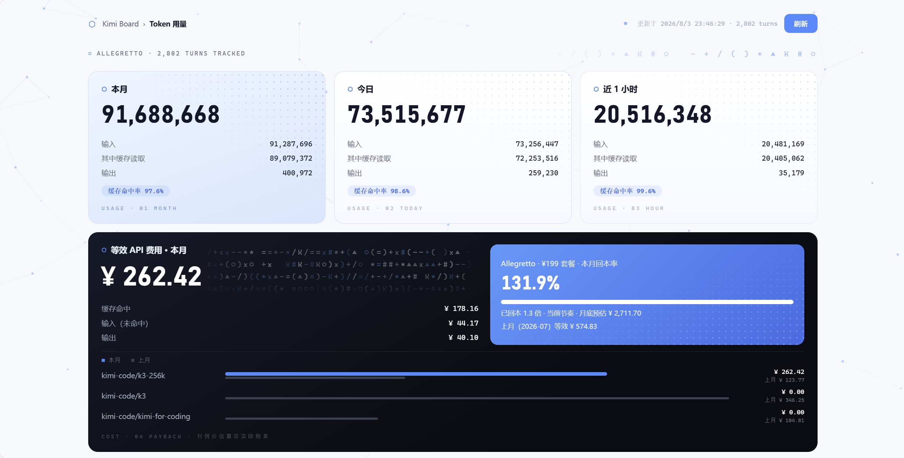

# kimi-board — Kimi Code token 用量看板

一个本地、轻量、零云端依赖的 [Kimi Code](https://www.kimi.com/code/) token 消耗看板。
数据全部来自本机 `~/.kimi-code` 会话记录，统计在本机完成，不上传任何东西。



## 功能

- **用量卡片**：本月 / 今日 / 近 1 小时的输入（含缓存读取）、输出与缓存命中率
- **费用估算**：按 [Kimi 开放平台刊例价](https://platform.kimi.com/docs/pricing/chat)
  折算本月等效 API 费用，含缓存命中 / 未命中 / 输出三项构成、按模型本月与上月对比
- **套餐回本率**：自动识别会员档位（kimi web 在线时读取档位价），计算回本进度与月底预估
- **趋势图**：最近 24 小时（按小时）与最近 30 天（按天）柱状图
- **排名**：按模型、按工作目录的 token 消耗排名
- **浏览器扩展**：在 Kimi Code WebUI 页面注入悬浮按钮，一键直达看板

## 安装（Windows，推荐下载 release）

1. 在 [Releases](../../releases) 下载 `kimi-board-vX.Y.Z-windows-x64.zip` 并解压到任意位置
2. 双击 **`start.bat`**（运行内置 exe，无需安装 Python），浏览器自动打开看板
3. 可选：双击 **`install-autostart.bat`**，以后开机静默自启；`uninstall-autostart.bat` 可取消
4. 可选（WebUI 悬浮按钮）：Chrome/Edge 打开 `chrome://extensions` →
   开启"开发人员模式" → "加载已解压的扩展程序" → 选择解压目录里的 `extension/` 文件夹。
   之后打开 Kimi Code WebUI（`kimi web`），右下角会出现"⬡ token 看板"按钮

> 注意：浏览器扩展本身无法读取本地文件，看板服务（exe）必须在运行，
> 扩展按钮才会带出数据；服务没跑时点击按钮会给出提示。

> 若系统关闭了动画效果（Windows 设置 → 辅助功能 → 视觉效果），看板的粒子背景
> 和字符场会静止。访问一次 `http://127.0.0.1:8321/?motion=on` 即可强制开启动效
> （记住在本机浏览器）；`?motion=off` 还原。

## 从源码运行（任意平台）

要求 Python 3.8+（仅标准库，无第三方依赖）：

```bash
python kimi_board.py                      # 默认 127.0.0.1:8321，自动打开浏览器
python kimi_board.py --port 9000 --plan-price 99 --no-open
```

| 参数 | 默认 | 说明 |
|---|---|---|
| `--port` | 8321 | 监听端口 |
| `--host` | 127.0.0.1 | 监听地址（仅本机回环） |
| `--plan-price` | 自动 | 会员月费；不显式指定时优先自动识别（需 kimi web 在线），识别失败按 199 计 |
| `--no-open` | 关 | 启动后不自动打开浏览器 |

另有命令行版统计工具：`python kimi_usage.py [--hours N | --month YYYY-MM | --all] [--by-workdir]`。

## 数据口径与费用说明

- 数据源：`$KIMI_CODE_HOME/sessions/*/*/agents/*/wire.jsonl`（默认 `~/.kimi-code/sessions`）
  中 `type=usage.record` 且 `usageScope=turn` 的记录（含子 agent；
  不含 session 级汇总记录，避免重复计数）。
- 服务按文件 mtime/size 缓存解析结果，刷新开销很小。
- 费用为**刊例价估算**，非实际账单；订阅会员是额度制，与 API 按量计费是两套体系。
- 价目硬编码在 `kimi_board.py` 顶部的 `PRICING` 表，官方调价后请手动更新
  （当前：k3 / k3-256k = 缓存命中 ¥2、未命中 ¥20、输出 ¥100 每百万 token；
  kimi-for-coding ≈ K2.7 Code = ¥1.3 / ¥6.5 / ¥27）。
- 模型与平台商品名的映射是人工假设（如 `k3-256k` 按 `kimi-k3` 计价），
  官方折算口径不同时数字会有出入。

## 自己打包 exe

```bash
pip install pyinstaller
pyinstaller --onefile --name kimi-board kimi_board.py   # 产物在 dist/
```

打 `v*` 标签推送到 GitHub 会自动构建 exe 并发布 release
（见 `.github/workflows/release.yml`）。

## License

MIT
